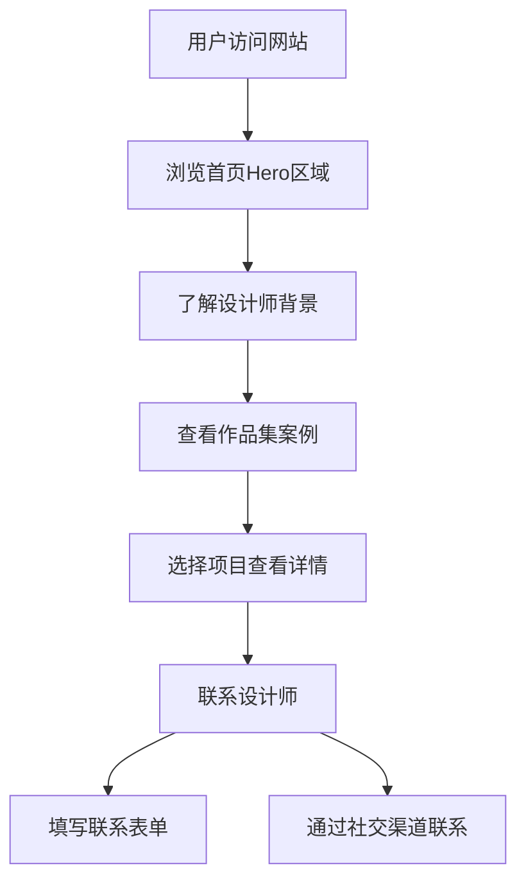

## 1. Product Overview
资深UI设计师个人作品集网站，旨在展示设计师的专业能力、项目案例和设计理念，吸引潜在客户和雇主。网站采用现代极简风格，强调视觉冲击力和用户体验。

- **核心目标**: 展示设计作品、建立个人品牌、促进商业合作
- **目标用户**: 企业客户、招聘方、设计同行、潜在合作方
- **市场价值**: 作为设计师的线上名片，在竞争激烈的设计行业中脱颖而出

## 2. Core Features

### 2.1 User Roles
| Role | Registration Method | Core Permissions |
|------|---------------------|------------------|
| 访客 | 无需注册 | 浏览所有页面、查看作品、联系设计师 |

### 2.2 Feature Module
1. **首页**: Hero区域、导航栏、快速作品预览、CTA
2. **关于我**: 设计师简介、设计理念、专业背景
3. **作品集**: 项目案例展示、案例详情、分类筛选
4. **服务**: 服务内容、技能展示、收费标准
5. **联系方式**: 联系表单、社交媒体、联系方式

### 2.3 Page Details
| Page Name | Module Name | Feature description |
|-----------|-------------|---------------------|
| 首页 | Hero区域 | 全屏视觉冲击，展示设计师品牌，平滑滚动进入 |
| 首页 | 导航栏 | 固定顶部，滚动时样式变化，移动端汉堡菜单 |
| 首页 | 作品预览 | 横向滚动或网格展示最新作品缩略图 |
| 首页 | CTA | 引导用户查看作品集或联系设计师 |
| 关于我 | 个人介绍 | 设计师背景、从业经验、设计理念阐述 |
| 关于我 | 成就展示 | 获得奖项、客户评价、数据统计 |
| 作品集 | 项目列表 | 分类筛选，瀑布流或网格布局展示项目 |
| 作品集 | 项目详情 | 项目背景、设计过程、挑战与解决方案、最终成果 |
| 服务 | 服务内容 | UI设计、UX设计、品牌设计等服务介绍 |
| 服务 | 技能标签 | 专业技能展示，可交互的技能雷达图 |
| 联系方式 | 联系表单 | 姓名、邮箱、项目类型、需求描述 |
| 联系方式 | 社交链接 | Dribbble、Behance、站酷、LinkedIn等 |

## 3. Core Process
用户访问网站 → 浏览首页Hero区域 → 了解设计师背景 → 查看作品集案例 → 选择感兴趣的项目查看详情 → 通过联系表单或社交渠道联系设计师

## 4. User Interface Design

### 4.1 Design Style
- **主色调**: 深灰色(#1a1a1a)作为背景，白色(#ffffff)作为主文字色，珊瑚红(#ff6b6b)作为强调色
- **辅助色**: 淡蓝色(#4ecdc4)用于次要强调，浅灰色(#f5f5f5)用于卡片背景
- **按钮风格**: 圆角矩形，悬停时有渐变背景和缩放效果
- **字体**: 标题使用Playfair Display衬线字体，正文使用Inter无衬线字体
- **布局**: 大量留白，网格系统，卡片式设计
- **动画**: 页面加载时的淡入效果，滚动触发的元素动画，悬停微交互

### 4.2 Page Design Overview

| Page Name | Module Name | UI Elements |
|-----------|-------------|-------------|
| 首页 | Hero区域 | 全屏背景、设计师姓名大标题、职业标签、向下滚动提示动画 |
| 首页 | 导航栏 | Logo、导航链接、移动端汉堡菜单图标 |
| 首页 | 作品预览 | 横向滚动容器、作品卡片、项目名称、分类标签 |
| 关于我 | 个人介绍 | 设计师头像、简介文字、引用块 |
| 关于我 | 成就展示 | 数字统计卡片、奖项徽章、客户Logo墙 |
| 作品集 | 项目列表 | 筛选标签、项目卡片、分类图标、悬停放大效果 |
| 作品集 | 项目详情 | 项目标题、项目标签、设计过程时间线、图片展示区 |
| 服务 | 服务内容 | 服务卡片、图标、描述文字、价格标签 |
| 服务 | 技能展示 | 技能标签云、交互式雷达图 |
| 联系方式 | 联系表单 | 输入框、下拉选择、文本域、提交按钮 |
| 联系方式 | 社交链接 | 社交媒体图标、hover变色效果 |

### 4.3 Responsiveness
- **桌面端**: 1200px+，完整布局，侧边栏导航可选
- **平板端**: 768px-1199px，自适应布局，减少留白
- **移动端**: <768px，单列布局，汉堡菜单，触控优化

### 4.4 3D Scene Guidance
- 不使用3D场景，保持简洁的2D界面设计
- 通过阴影、渐变、动画营造层次感