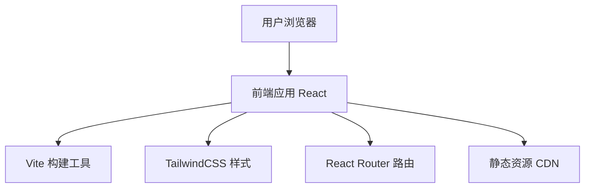

## 1. Architecture Design


## 2. Technology Description
- **Frontend**: React@18 + TypeScript + TailwindCSS@3
- **Initialization Tool**: vite-init
- **Build Tool**: Vite@5
- **Routing**: react-router-dom@6
- **State Management**: Zustand (轻量级状态管理)
- **Icons**: lucide-react
- **Animation**: Framer Motion (可选)
- **Backend**: None (纯静态展示网站)
- **Database**: None

## 3. Route Definitions
| Route | Purpose | Component |
|-------|---------|-----------|
| / | 首页 | HomePage |
| /about | 关于我 | AboutPage |
| /portfolio | 作品集列表 | PortfolioPage |
| /portfolio/:id | 项目详情 | ProjectDetailPage |
| /services | 服务内容 | ServicesPage |
| /contact | 联系方式 | ContactPage |

## 4. API Definitions
无需后端API，所有内容为静态数据

## 5. Data Model

### 5.1 Project Data Structure
```typescript
interface Project {
  id: string;
  title: string;
  category: 'ui' | 'ux' | 'brand' | 'web' | 'mobile';
  client: string;
  year: number;
  description: string;
  overview: string;
  challenges: string[];
  solutions: string[];
  results: {
    metric: string;
    value: string;
  }[];
  images: {
    src: string;
    alt: string;
  }[];
  tags: string[];
}
```

### 5.2 Service Data Structure
```typescript
interface Service {
  id: string;
  title: string;
  icon: string;
  description: string;
  features: string[];
  pricing: {
    package: string;
    price: number;
    period: string;
  }[];
}
```

### 5.3 Skill Data Structure
```typescript
interface Skill {
  name: string;
  category: 'design' | 'tools' | 'soft';
  level: number; // 1-100
}
```

## 6. Project Structure
```
src/
├── components/
│   ├── Header/          # 导航栏组件
│   ├── Hero/            # 首页Hero组件
│   ├── PortfolioCard/   # 作品卡片组件
│   ├── ProjectDetail/   # 项目详情组件
│   ├── SkillRadar/      # 技能雷达图组件
│   ├── ContactForm/     # 联系表单组件
│   └── Footer/          # 页脚组件
├── pages/
│   ├── HomePage.tsx     # 首页
│   ├── AboutPage.tsx    # 关于页
│   ├── PortfolioPage.tsx # 作品集列表页
│   ├── ProjectDetailPage.tsx # 项目详情页
│   ├── ServicesPage.tsx # 服务页
│   └── ContactPage.tsx  # 联系页
├── data/
│   ├── projects.ts      # 项目数据
│   ├── services.ts      # 服务数据
│   └── skills.ts        # 技能数据
├── hooks/
│   └── useScroll.ts     # 滚动监听Hook
├── utils/
│   └── helpers.ts       # 工具函数
├── App.tsx
├── main.tsx
└── index.css
```

## 7. Performance Optimization
- 图片懒加载
- 代码分割
- CSS优化
- 静态资源压缩

## 8. Deployment
- 部署平台: Vercel / Netlify
- CI/CD: GitHub Actions
- 域名配置: 自定义域名